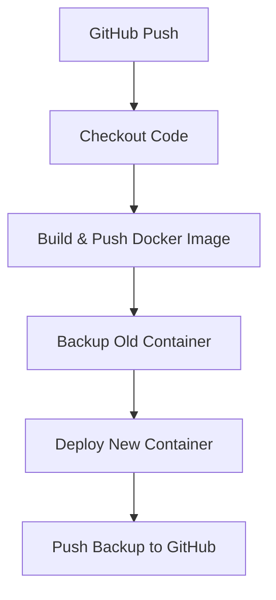

# 🚀 CV Project – Jenkins CI/CD with Docker & GitHub Backup

## 📌 Overview

This project demonstrates a **CI/CD pipeline using Jenkins, Docker, and GitHub**.
It automates the process of:

1. Pulling the latest code from GitHub.
2. Building and pushing a Docker image to DockerHub.
3. Creating a backup from the old running container.
4. Deploying a new container with the updated image.
5. Archiving and pushing the backup to a separate GitHub repository.

---

## ⚙️ Prerequisites

Ensure the following are installed and configured:

* **Jenkins** with plugins:

  * Git
  * Docker Pipeline
* **Docker Engine** installed on the Jenkins server.
* **DockerHub** account.
* **Two GitHub repositories**:

  * Main project repo (e.g., `cv-project`)
  * Backup repo (e.g., `cv-backups`)

---

## 🔑 Jenkins Credentials

| ID               | Type                | Usage                 |
| ---------------- | ------------------- | --------------------- |
| `yahyadockerhub` | Username + Password | DockerHub login       |
| `yahiagithub`    | Username + Token    | GitHub authentication |

---

## 📂 Project Structure

```
cv-project/
│── Jenkinsfile       # CI/CD pipeline definition
│── Dockerfile        # Docker image build instructions
│── index.html        # Web application (CV page)
│── README.md         # Project documentation
```

---

## ⚡ Pipeline Workflow



---

## 📦 Backup Details

* Backups are timestamped and stored in the format:

  ```
  backups/YYYY-MM-DD-HH-MM/
  ```
* Example commit message in the backup repo:

  ```
  Backup on 2025-09-19-20-30
  ```

---

## 🌐 Example Repositories

* **Main App** → [cv-project](https://github.com/Yahia58/cv-project)
* **Backups Repo** → [cv-backups](https://github.com/Yahia58/cv-backups)

---

## 📝 Notes

* If no old container is found, the pipeline will skip the backup stage gracefully.
* Port mapping (`8090:80`) can be changed as needed.
* Ensure Jenkins has permission to run Docker commands.
